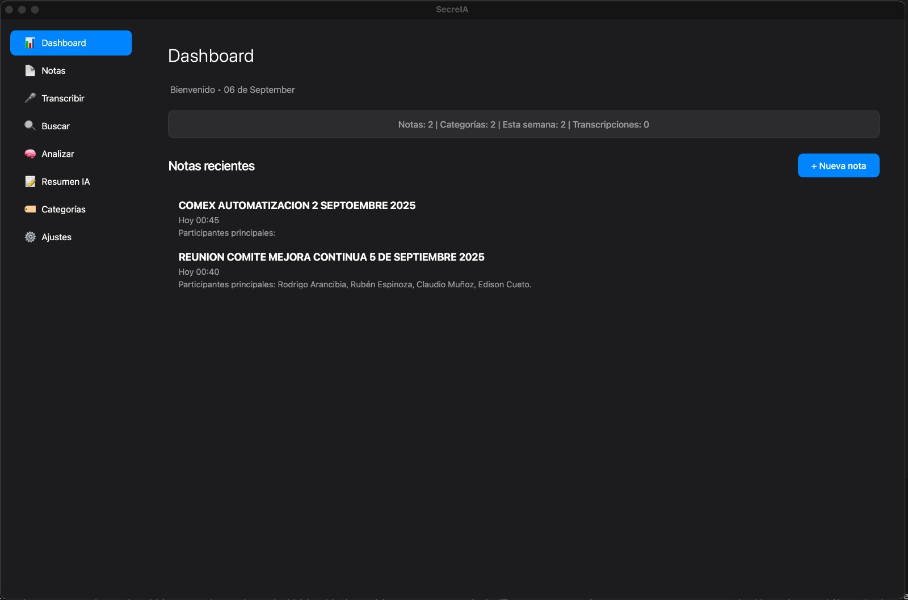
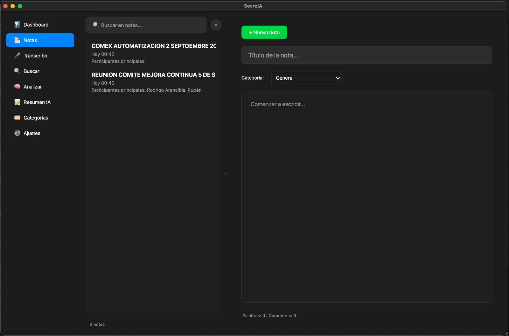
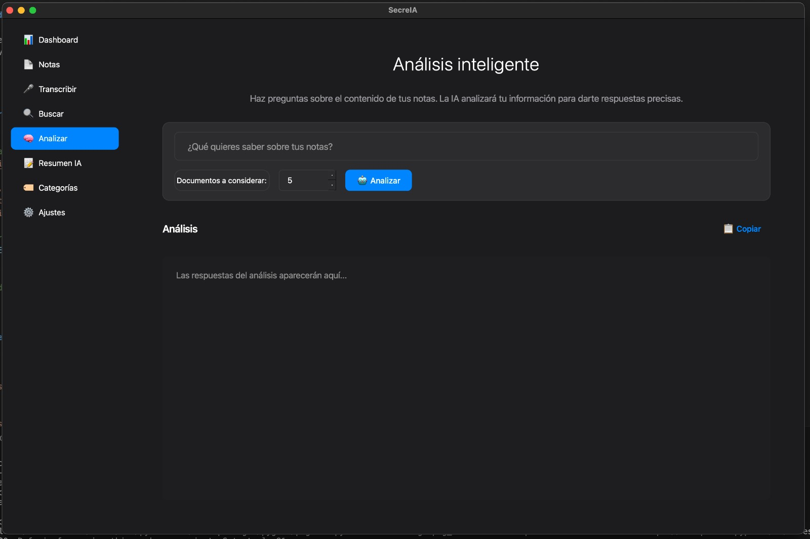
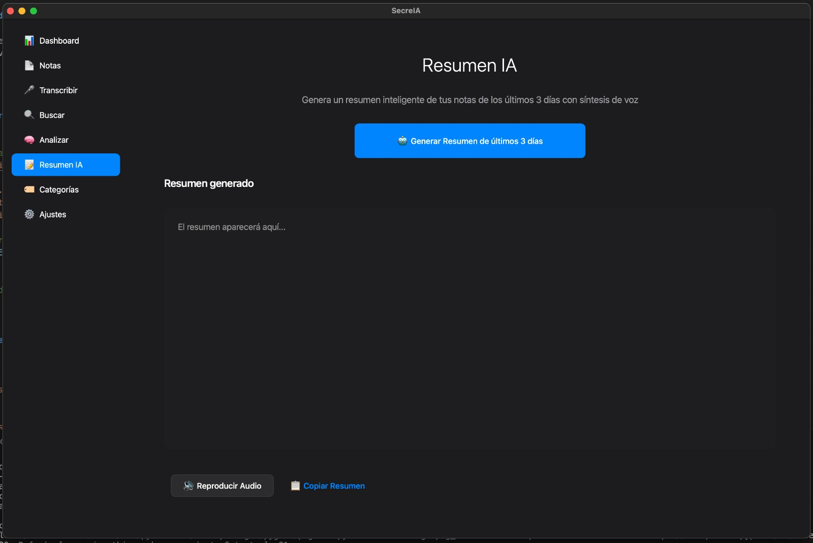
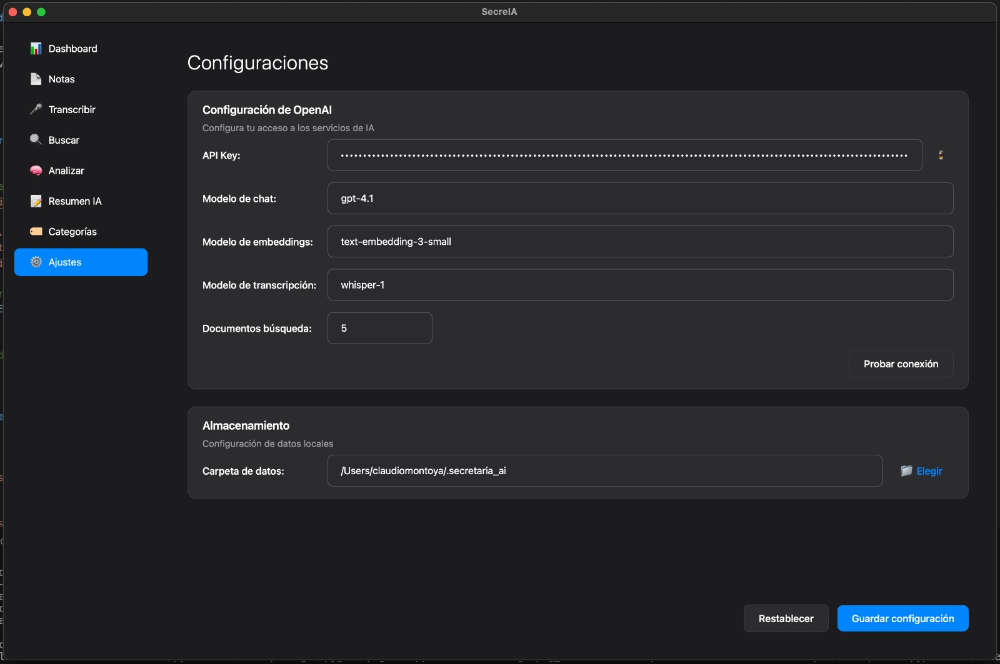

# SecreIA

**Asistente inteligente para notas y transcripciones con IA**


## 📸 Vista previa

<div align="center">

| | | |
|---|---|---|
|  |  |  |
|  |  |  |

</div>
SecreIA es una aplicación nativa para macOS que combina gestión inteligente de notas, transcripción de audio en tiempo real y análisis con IA para maximizar tu productividad. Diseñada específicamente para profesionales que necesitan organizar información de manera eficiente.

## ✨ Características principales

### 📝 Gestión inteligente de notas
- **Editor avanzado** con autoguardado y generación automática de títulos
- **Categorización inteligente** usando IA para organizar contenido
- **Búsqueda semántica** que entiende el contexto de tus consultas
- **Exportación múltiple** a Markdown, JSON y texto plano

### 🎤 Transcripción en tiempo real
- **Reconocimiento de voz avanzado** optimizado para español chileno
- **Pipeline de audio profesional** con detección de speakers
- **Deduplicación inteligente** para evitar texto repetido
- **Configuración de calidad adaptativa** para diferentes condiciones

### 🧠 Análisis con IA
- **RAG (Retrieval-Augmented Generation)** para consultas contextuales
- **Resúmenes ejecutivos** de tus notas con síntesis de voz
- **Análisis de tendencias** y patrones en tu información
- **Respuestas basadas en tu contenido** específico

### 🎨 Diseño Apple-native
- **Interfaz estilo Apple** que se integra perfectamente con macOS
- **Tema oscuro nativo** optimizado para largas sesiones
- **Navegación intuitiva** con shortcuts de teclado
- **Soporte HiDPI** para pantallas Retina

## 🚀 Instalación

### Requisitos del sistema
- macOS 11.0 (Big Sur) o superior
- 4 GB de RAM mínimo (8 GB recomendado)
- 2 GB de espacio libre en disco
- Micrófono (para transcripción)
- Conexión a internet (para funciones de IA)

#### Windows (Beta)
- Windows 10 versión 1903 o superior / Windows 11
- 4 GB de RAM mínimo (8 GB recomendado)
- 2 GB de espacio libre en disco
- Micrófono (para transcripción)
- Conexión a internet (para funciones de IA)

> **Nota**: El soporte para Windows está en fase beta. Algunas funciones pueden requerir configuración adicional.


### Instalación automática

# 🛠️ flujo de construcción y firma para SecreIA

## Generar certificado de firma de código en macOS

1. Abre **Acceso a Llaveros** → selecciona el llavero **Inicio de sesión**.
2. Menú **Acceso a Llaveros > Asistente de Certificados > Crear un Certificado…**
3. Configura:

   * **Nombre**: `SecreIA Developer` (puedes usar otro, solo recuerda el nombre exacto).
   * **Identidad de certificado**: **Firma de código**.
   * **Ubicación**: **Inicio de sesión**.
4. Una vez creado:

   * Expande el certificado → debe aparecer la **clave privada** debajo.
   * Doble clic → pestaña **Confiar** → en **Firma de código** selecciona **Siempre Confiar**.
5. Confirma con tu contraseña.
6. Comprueba que aparece en terminal:

   ```bash
   security find-identity -v -p codesigning
   ```

# 🛠️ construcción Automática

```bash
# Clonar el repositorio
git clone https://github.com/claudiomontoya/SecreIA.git
cd SecreIA

# Ejecutar script de construcción
chmod +x build_signed.sh
./build_signed.sh

# Opción 2: Instalación limpia (elimina todas las notas y configuraciones)
./build_signed.sh --clean-db
```

El script automáticamente:
- ✅ Instala dependencias del sistema (PortAudio via Homebrew)
- ✅ Configura entorno virtual Python 3.11
- ✅ Instala todas las dependencias
- ✅ Construye la aplicación nativa
- ✅ Configura permisos de micrófono
- ✅ Registra la app en Launch Services

### Instalación manual

<details>
<summary>Ver pasos detallados</summary>

1. **Instalar Homebrew** (si no está instalado):
```bash
/bin/bash -c "$(curl -fsSL https://raw.githubusercontent.com/Homebrew/install/HEAD/install.sh)"
```

2. **Instalar PortAudio**:
```bash
brew install portaudio
```

3. **Configurar Python**:
```bash
python3.11 -m venv .venv
source .venv/bin/activate
```

4. **Instalar dependencias**:
```bash
export LDFLAGS="-L$(brew --prefix portaudio)/lib"
export CPPFLAGS="-I$(brew --prefix portaudio)/include"
pip install -r requirements.txt
```

5. **Construir aplicación**:
```bash
pyinstaller --windowed --name "SecreIA" run_app.py
```

</details>

## ⚙️ Configuración

### Primera ejecución
1. **Abrir SecreIA** desde Applications
2. **Configurar OpenAI API Key** para funciones de IA
3. **Permitir acceso al micrófono** cuando macOS lo solicite
4. **Seleccionar carpeta de datos** (por defecto: `~/.secretaria_ai`)

### Configuración avanzada

```json
{
  "chat_model": "gpt-4o-mini",
  "embedding_model": "text-embedding-3-small",
  "transcription_model": "whisper-1",
  "top_k": 5
}
```

## 🎯 Casos de uso

### Para reuniones profesionales
- **Transcripción automática** de juntas y conferencias
- **Detección de speakers** para distinguir participantes
- **Extracción de action items** y decisiones clave
- **Resúmenes ejecutivos** automáticos

### Para investigación y estudio
- **Organización semántica** de notas de investigación
- **Búsqueda inteligente** por conceptos, no solo palabras
- **Análisis de patrones** en grandes volúmenes de información
- **Síntesis de contenido** para revisiones rápidas

### Para creadores de contenido
- **Captura rápida** de ideas mediante voz
- **Categorización automática** por temas y proyectos
- **Generación de resúmenes** para contenido social
- **Exportación versátil** para diferentes plataformas

## 🏗️ Arquitectura técnica

### Stack principal
- **Frontend**: PySide6 (Qt) con diseño Apple-native
- **Backend**: Python 3.11 con arquitectura modular
- **Base de datos**: SQLite para notas + ChromaDB para vectores
- **IA**: OpenAI GPT-4 + Embeddings + Whisper
- **Audio**: SpeechRecognition + SoundDevice + PortAudio

### Componentes clave

```
app/
├── main.py          # Interfaz principal y orchestración
├── ai.py            # Servicios de IA (OpenAI integration)
├── db.py            # Gestión de base de datos SQLite
├── vectorstore.py   # Índice vectorial y búsqueda semántica
├── audio.py         # Pipeline de audio y grabación
└── settings.py      # Configuración y persistencia
```

### Pipeline de transcripción
```
Micrófono → Captura continua → Reconocimiento en chunks →
Deduplicación → Corrección contextual → Indexación semántica
```

### Flujo de búsqueda semántica
```
Query → Expansión de términos → Embedding → Búsqueda vectorial →
Re-ranking por relevancia → Snippet inteligente
```

## 🔧 Desarrollo

### Configurar entorno de desarrollo

```bash
# Clonar y configurar
git clone https://github.com/claudiomontoya/SecreIA.git
cd SecreIA
python3.11 -m venv .venv
source .venv/bin/activate
pip install -r requirements.txt

# Variables de entorno para desarrollo
export OPENAI_API_KEY="tu-api-key"
export DEBUG=1

# Ejecutar en modo desarrollo
python run_app.py
```

### Contribuir

1. **Fork** el repositorio
2. **Crear branch** feature (`git checkout -b feature/nueva-funcionalidad`)
3. **Commit** cambios (`git commit -am 'Agregar nueva funcionalidad'`)
4. **Push** al branch (`git push origin feature/nueva-funcionalidad`)
5. **Crear Pull Request**


## 🛠️ Solución de problemas

### Problemas comunes

**Error: "No se puede acceder al micrófono"**
```bash
# Verificar permisos en Sistema > Privacidad y Seguridad > Micrófono
# Reiniciar la aplicación después de dar permisos
```

**Error: "ChromaDB no está disponible"**
```bash
# Limpiar base de datos corrupta
rm -rf ~/.secretaria_ai/chroma/
# Reiniciar la aplicación
```

**Error: "OpenAI API Error"**
```bash
# Verificar API key en Configuración
# Verificar conexión a internet
# Verificar créditos en cuenta OpenAI
```

### Logs de depuración

Los logs se guardan en:
- macOS: `~/Library/Logs/SecreIA/app.log`
- Configuración: `~/.secretaria_ai/config.json`
- Base de datos: `~/.secretaria_ai/notes.db`


### Próxima refactorización

El proyecto está migrando hacia una arquitectura más modular:

```
app/
├── ui/
│   ├── components/     # AppleButton, AppleCard, LoadingSpinner
│   ├── tabs/          # DashboardTab, NotesTab, TranscribeTab
│   ├── dialogs/       # WelcomeScreen, SetupScreen
│   └── workers/       # AnalysisWorker, SummaryWorker
├── core/
│   ├── ai.py          # Servicios de IA
│   ├── db.py          # Base de datos
│   ├── vectorstore.py # Búsqueda semántica
│   └── audio.py       # Pipeline de audio
├── utils/
│   ├── exceptions.py  # Excepciones específicas
│   └── logging.py     # Sistema de logs
└── main.py            # Punto de entrada (200-300 líneas)
```

### Mejoras planeadas
- **Separación de concerns**: UI, lógica de negocio y servicios
- **Manejo de errores robusto**: Excepciones específicas por módulo  
- **Sistema de logging**: Trazabilidad completa de operaciones
- **Tests automatizados**: Cobertura del 80%+ del código crítico

### Áreas que necesitan ayuda
- **Testing**: Escribir tests unitarios y de integración
- **Documentación**: Mejorar comentarios en código complejo
- **UI/UX**: Refinamiento de la interfaz Apple-native
- **Optimización**: Mejoras de rendimiento en búsqueda vectorial
- **Accesibilidad**: Soporte VoiceOver y navegación por teclado

## 📄 Licencia

Este proyecto está licenciado bajo la Licencia MIT. Ver el archivo [LICENSE](LICENSE) para más detalles.

## 🤝 Soporte y comunidad

- **Issues**: [GitHub Issues](https://github.com/claudiomontoya/SecreIA/issues)
- **Discussions**: [GitHub Discussions](https://github.com/claudiomontoya/SecreIA/discussions)
- **Email**: claudio.montoya@biopc.cl


